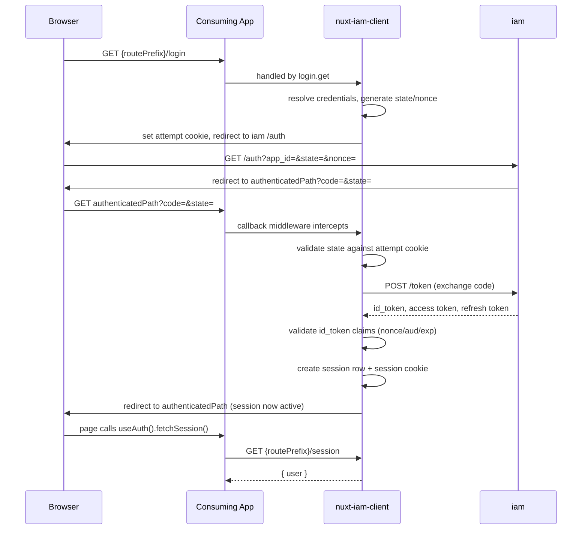
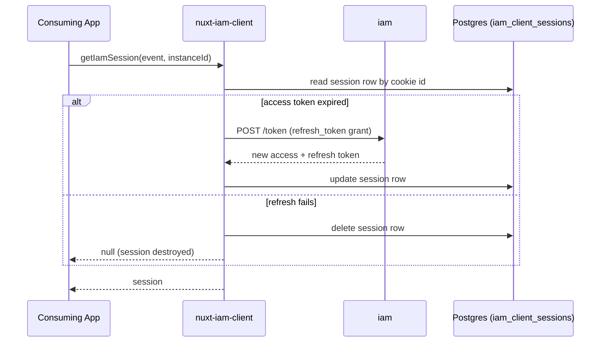

# Features

`nuxt-iam-client` is a Nuxt module implementing the client side of `iam`'s
SSO flow (see `web/iam/docs/user-guides/IAM_CLIENT_IMPLEMENTATION.md` for the protocol it
implements). It was extracted from `TestIam` so other Nuxt apps in `web/`
can adopt the same `iam` integration without re-implementing it.

## What it provides

- **Server routes** (auto-registered under `routePrefix`, default `/api/auth`):
  - `GET /login` — starts the OAuth flow by redirecting to `iam`'s
    authorization endpoint, or skips straight to `afterLoginPath` if a valid
    session already exists.
  - `POST /logout` — destroys the current session and redirects to
    `afterLogoutPath`.
  - `GET /session` — returns `{ user: { username, email } | null }` for the
    current visitor.
- **Callback middleware** that intercepts the `?code=&state=` redirect `iam`
  sends back to `authenticatedPath`:
  - Validates the `state`/`nonce` pair against the attempt cookie set at
    login time (CSRF/replay protection).
  - Exchanges the authorization `code` for tokens.
  - Validates the returned `id_token`'s claims: `nonce` matches the login
    attempt, `aud` matches the resolved app id, and `exp` hasn't passed.
  - Creates a session row and session cookie on success; redirects to
    `notAuthenticatedPath` on any failure (state mismatch, expired token,
    failed exchange, etc.).
- **Session storage** in a Postgres table the module manages itself
  (`iam_client_sessions`), with:
  - Automatic migration on first request — no manual migration step in the
    consuming app.
  - Transparent access-token refresh: an expired access token is refreshed
    against `iam` using the stored refresh token the next time the session
    is read; a failed refresh destroys the session and the caller sees
    `user: null`.
  - Multi-mount support: sessions from every mount in the same app (e.g. two
    `instanceId`s) share one physical table, distinguished by an
    `instance_id` column.
  - A `setIamSessionMetadata(event, instanceId, metadata)` server util to
    attach app-specific metadata (e.g. a role or tenant id looked up after
    login) to the session, merged into whatever is already stored.
- **`useAuth()` composable** (auto-imported; name configurable via
  `composableAlias`) exposing:
  - `user` — a reactive `AuthUser | null` (`{ username, email }`).
  - `status` — computed `'authenticated' | 'unauthenticated'`.
  - `fetchSession()` — fetches `/session` and updates `user`.
  - `logout()` — calls `/logout`, clears `user`, and navigates to
    `afterLogoutPath`.
- **Multiple mounts from one module registration** — an app can register
  more than one independent `iam` integration (e.g. an `admin` SSO instance
  and a per-tenant `dynamic` instance) by passing `{ instances: [...] }`
  instead of a single options object, each with its own routes, composable
  name, and cookie namespace. See `docs/user-guides/config.md`.
- **Dynamic credential resolution** — an instance can resolve its
  `{ url, appId, clientSecret }` per request instead of at build time, via a
  `resolveIamAppCredentials(event)` util the consuming app defines. Useful
  for one mount serving many logical clients (e.g. one per tenant).
- **Gated diagnostic logging** — every step of the login/callback/refresh
  flow logs via `iamDebugLog`, enabled by setting
  `NUXT_ADD_DEBUG_LOGS=true`; silent otherwise.

## What it does NOT provide

Any actual pages or UI. The consuming app still owns:
- A page at the path registered as `authenticated_url` with `iam` (see
  `authenticatedPath` in `docs/user-guides/config.md`) — this is where the
  OAuth code lands and `fetchSession()` is typically called.
- A page at `notAuthenticatedPath` for failed/rejected logins.
- Wherever `afterLoginPath`/`afterLogoutPath` point.
- Whatever UI shows the signed-in user's data.
- The `resolveIamAppCredentials(event)` util, when using `dynamic: true`.

## Sequence: login flow

## Sequence: session refresh

